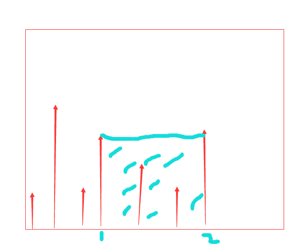

## LeetCode 11. Container With Most Water解题报告

---

**描述**
<br>
Given n non-negative integers a1, a2, ..., an, where each represents a point at coordinate (i, ai). n vertical lines are drawn such that the two endpoints of line i is at (i, ai) and (i, 0). Find two lines, which together with x-axis forms a container, such that the container contains the most water.

note: You may not slant the container and n is at least 2.

---
画出图像如下
</img>
大概的意思就是要我们在数轴和两个目标杆之间找到一个最大面积的矩形。

最简单的思路就是找到每个柱子两边的最高柱子然后比较即可，复杂度为O(n^2)。
因为得到一个矩形需要比较2个柱子的高低所以可以考虑使用两个指针对向移动,
从末尾和头分别布置一个指针，<font color=red>每次移动比较矮的柱子，因为高的柱子可能会有其他更高的柱子出现使得面积有扩大的可能</font>，移动2个指针直到相遇，复杂度为O(n)。
具体代码如下:

```java
class Solution {
    public int maxArea(int[] height) {
        int max = 0;
        int left = 1, right = height.length;
        max = (right-left)*(Math.min(height[right-1], height[left-1]));
        while (left < right) {
        	if (height[right-1] < height[left-1]) {
        		right--;
        	} else {
        		left++;
        	}
        	max = max  >= (right-left)*(Math.min(height[right-1], height[left-1])) ? max : (right-left)*(Math.min(height[right-1], height[left-1]));
        }
        return max;
    }
}
```