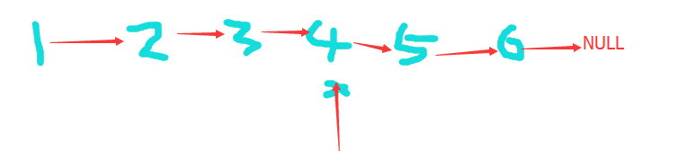
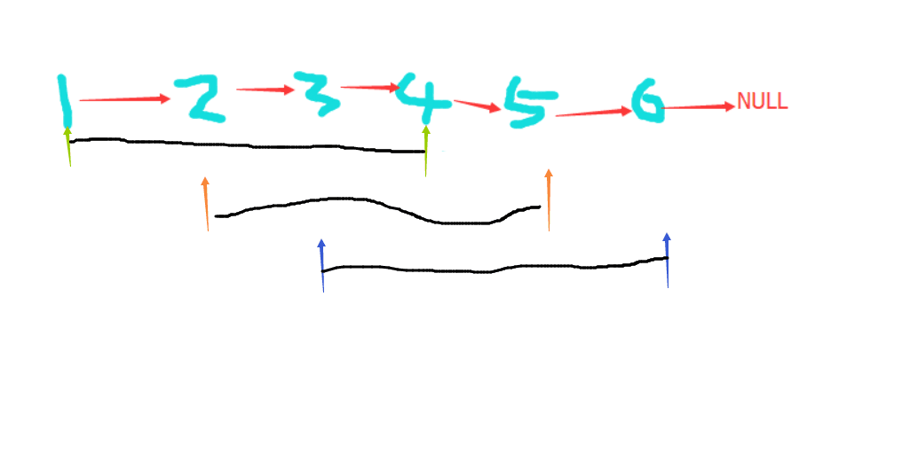

# LeetCode 19. Remove Nth Node From End of List 解题报告
---
**描述**
Given a linked list, remove the nth node from the end of list and return its head.

For example,

>   Given linked list: 1->2->3->4->5, and n = 2.
>   After removing the second node from the end, the linked list becomes 1->2->3->5.

Note:
Given n will always be valid.
Try to do this in one pass.

---

**分析**
题目要求删除倒数第N个链表节点,难点在于不知道链表的长度,要一次遍历定位到节点的话需要一个指针肯定是不行的.
分析下面的这样的一个链表:

删除倒数第三个4,肯定要有一个指针在删除前指向4的前一个3,用来测量4是倒数第3个就要有一个指针指向6,
所以要用两个间隔为3到6这样距离的指针来迭代直到后一个指针
如下图的过程

需要考虑长度为1的特殊情况
--
**AC代码**
```java
    public ListNode removeNthFromEnd(ListNode head, int n) {
        ListNode pos = head;        
        ListNode pre = head;
        for (int i = 0; i < n; ++i) {
            pos = pos.next;
        }
        if (pos == null) {
            head = head.next;
            return head;
        }
        while(pos.next != null) {
            pos = pos.next;
            pre = pre.next;
        }
        pre.next = pre.next.next;
        return head;
    }
```