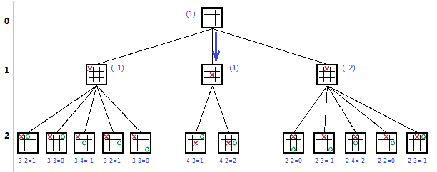

# 零和博弈算法之极大极小搜索和$\alpah-\beta剪枝$算法解决 Leetcode 464 can i win

##  极大极小搜索算法介绍
	Minimax算法 又名极小化极大算法，是一种找出失败的最大可能性中的最小值的算法（即最小化对手的最大得益）。通常以递归形式来实现。
	Minimax算法常用于棋类等由两方较量的游戏和程序。该算法是一个**零总和**算法，即一方要在可选的选项中选择将其优势最大化的选择，另一方则选择令对手优势最小化的一个，
	其输赢的总和为0（有点像能量守恒，就像本身两个玩家都有1点，最后输家要将他的1点给赢家，但整体上还是总共有2点）。
	很多棋类游戏可以采取此算法，比如五子棋（我有写这个算法的五子棋大家可以参看以下但是效率不高
[五子棋](https://github.com/jiaxin96/AI/tree/master/)

	极大极小搜索算法基于一个启发式估值函数f(n),
>>	f定义如下：
	max和min代表对弈双方；
	p代表一个棋局（即一个状态）；
	有利于MAX的态势，f(p)取正值；
	有利于MIN的态势，f(p)取负值；
	态势均衡，f(p)取零值；
	如果这个一个博弈，运用MINMAX的基本思想进行选择时有如下策略
	（1）当轮到MIN走步时，MAX应该考虑最坏的情况（即f(p)取极小值）
	（2）当轮到MAX走步时，MAX应该考虑最好的情况（即f(p)取极大值）
	（3）相应于两位棋手的对抗策略，交替使用（1）和（2）两种方法传递倒推值

**例子**
	举一个井字棋的例子
	取一个残局博弈树如下：

>>	我们定义f（state）表示当前棋局估值，state表示当前棋局，
	f的取值如下：
	X输 -1
    平局 0
    X赢  1
    假设当前在最顶层，我们是X即要最大化f的一方，需要得到下一步的落子点，通过搜索树观察下一层的f可以知道，只有下成最左边的棋局可以得到最大的f=0，也就是平局，
    和说明在目前的计算深度下，对X讲最好的结果就是下成左边的情况这样会变成平局，其他的下法都会输。

**进一步思考**
    通过这个例子我们知道了以下几点：

>>    0.极大极小搜索算法是一个深度优先搜索的算法。
    1.每个搜索树节点的值都来自下层节点，所有节点的值都是最下层节点反馈回去的。
    2.min层就是最小化f的层，的每个节点的值取自己子节点的最小值。
    3.max层就是最大化f的层，的每个节点的值取自己子节点的最大值。
    4.算法有深度的限制。
    
**减枝操作**

	上面的井字棋的一个例子中我们可以穷尽局面而且分支数量也少,但是一些复杂的搜索和对弈中就不可能穷尽分支数量也是巨大,
	这就需要我们通过一些操作来减少搜索的空间,通过对上面的分析,我们知道了,min层的每个节点的值选择的是子层最小的节点的估计值,并且是通过深度优先反馈回来的,max选择的是子层最大节点的估计值n那么我们就可以在挑选本层节点的子节点的一些值的时候进行舍弃操作，
	比如现在处于max层，要挑选子层节点的最大值,子层是min层,也就是现在要从小的里面挑一个最大值.
	但是我们注意到这些小值也就是子层的值是一个一个接连产生的,b并且每个子层值只会不断变小,但是我们在max层要的是大的子层值,所以可以提前终止一个不断变小的子层分支.图示如下:
	
	