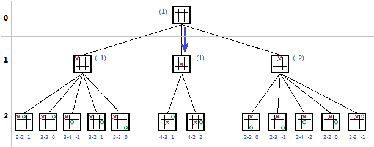
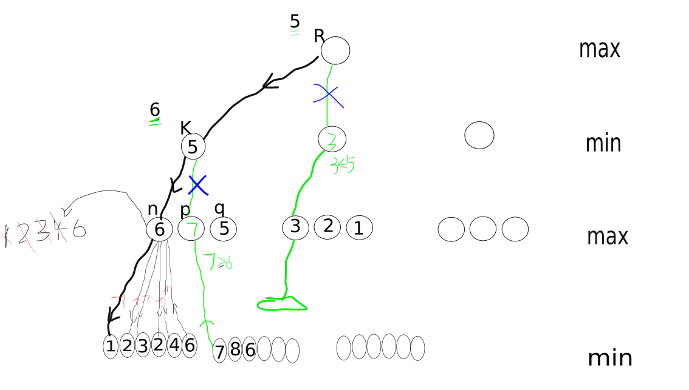

# 零和博弈算法之极大极小搜索和$\alpah-\beta剪枝$算法解决 486. Predict the Winner
<script type="text/javascript" src="http://cdn.mathjax.org/mathjax/latest/MathJax.js?config=default"></script>
##  极大极小搜索算法介绍
	Minimax算法 又名极小化极大算法，是一种找出失败的最大可能性中的最小值的算法（即最小化对手的最大得益）。通常以递归形式来实现。
	Minimax算法常用于棋类等由两方较量的游戏和程序。该算法是一个**零总和**算法，即一方要在可选的选项中选择将其优势最大化的选择，另一方则选择令对手优势最小化的一个，
	其输赢的总和为0（有点像能量守恒，就像本身两个玩家都有1点，最后输家要将他的1点给赢家，但整体上还是总共有2点）。
	很多棋类游戏可以采取此算法，比如五子棋（我有写这个算法的五子棋大家可以参看以下但是效率不高
[五子棋](https://github.com/jiaxin96/AI/tree/master/)

	极大极小搜索算法基于一个启发式估值函数f(n),
>>	f定义如下：
	max和min代表对弈双方；
	p代表一个棋局（即一个状态）；
	有利于MAX的态势，f(p)取正值；
	有利于MIN的态势，f(p)取负值；
	态势均衡，f(p)取零值；
	如果这个一个博弈，运用MINMAX的基本思想进行选择时有如下策略
	（1）当轮到MIN走步时，MAX应该考虑最坏的情况（即f(p)取极小值）
	（2）当轮到MAX走步时，MAX应该考虑最好的情况（即f(p)取极大值）
	（3）相应于两位棋手的对抗策略，交替使用（1）和（2）两种方法传递倒推值

**例子**
	举一个井字棋的例子
	取一个残局博弈树如下：



>>	我们定义f（state）表示当前棋局估值，state表示当前棋局，
	f的取值如下：
	X输 -1
    平局 0
    X赢  1
    假设当前在最顶层，我们是X即要最大化f的一方，需要得到下一步的落子点，通过搜索树观察下一层的f可以知道，只有下成最左边的棋局可以得到最大的f=0，也就是平局，
    和说明在目前的计算深度下，对X讲最好的结果就是下成左边的情况这样会变成平局，其他的下法都会输。

**进一步思考**
    通过这个例子我们知道了以下几点：

>>    0.极大极小搜索算法是一个深度优先搜索的算法。
    1.每个搜索树节点的值都来自下层节点，所有节点的值都是最下层节点反馈回去的。
    2.min层就是最小化f的层，的每个节点的值取自己子节点的最小值。
    3.max层就是最大化f的层，的每个节点的值取自己子节点的最大值。
    4.算法有深度的限制。
    
**减枝操作**

	上面的井字棋的一个例子中我们可以穷尽局面而且分支数量也少,但是一些复杂的搜索和对弈中就不可能穷尽分支数量也是巨大,
	这就需要我们通过一些操作来减少搜索的空间,通过对上面的分析,我们知道了,min层的每个节点的值选择的是子层最小的节点的估计值,并且是通过深度优先反馈回来的,max选择的是子层最大节点的估计值n那么我们就可以在挑选本层节点的子节点的一些值的时候进行舍弃操作，
	比如现在处于max层，要挑选子层节点的最大值,子层是min层,也就是现在要从小的里面挑一个最大值.
	但是我们注意到这些小值也就是子层的值是一个一个接连产生的,b并且每个子层值只会不断变小,但是我们在max层要的是大的子层值,所以可以提前终止一个不断变小的子层分支.图示如下:

	
	假设我们现在处于节点R处在max层,限制搜索深度为3层,首先算法会向下去搜索并在第三层算出状态的评估值,
	首先得到子层反馈的值节点是n节点,n节点的值依次更新为1,2,3,4,6.最终取子层最大的值6,并把6反馈给k节点,此时k节点的值暂时认为是6,
	而且k节点知道自己的值不会比6更大,因为处于min层,只会不断的选小的值.注意看绿色的线条,这是在K知道自己的上界为6的时候的计算过程,算法搜索到p节点,p扩展自己的第一个子节点得到值7,并且p知道自己以后的值不会比7小,因为p在max层,但是<font>此时p得到由父节点k传递过来的值6,
	知道k需要的是一个小于6的值,但是自己本身的值不会低于7,
	所以自己在继续探索也不会对父节点的取值有影响,所以p这一树枝,就可以停止搜索了,也就是剪枝.图中蓝色的叉</font color='red'>
	同理,对于R节点,得到K的值5后,暂时认为R的值是5并且不会低于5,在搜索K右边节点的时候发现它不会比3大,也即是R的下届大于子节点的上界,那么这一枝也可以剪去.

**$\alpha-\beta 剪枝$**
>>　通过上面的实例分析，我们知道了有２中剪枝的情况，那就是
	1.max层的下界大于子层min层的上界那么子层min层就没有必要继续搜索，就是父层最小也比子层最大大。
	2.min层的上界小于子层max层的下界那么子层max层就没有必要继续搜索，就是父层最大也比子层最小小。

	于是我们使用2个变量，$\alpha$表示max下界和$\beta$表示min上界，min层接受父层的$\alpha$即父层的暂时的最小值，和自己的每次得到的小值也就是自己的上界即$\beta$比较，一旦发现$\alpha >= \beta$那么自己本身就没有比较继续搜索了。
	同理max层接受父层的$\beta$即父层的暂时的最大值，和自己的每次得到的大值也就是自己的下界即$\alpha$比较，一旦发现$\alpha >= \beta$那么自己本身就没有比较继续搜索了。
---

**实际问题的解决**

>  解决 Leetcode 486. Predict the Winner


##### 题目描述
>>Given an array of scores that are non-negative integers. Player 1 picks one of the numbers from either end of the array followed by the player 2 and then player 1 and so on. Each time a player picks a number, that number will not be available for the next player. This continues until all the scores have been chosen. The player with the maximum score wins.

Given an array of scores, predict whether player 1 is the winner. You can assume each player plays to maximize his score.

>> Example 1:
Input: [1, 5, 2]
Output: False
Explanation: Initially, player 1 can choose between 1 and 2. 
If he chooses 2 (or 1), then player 2 can choose from 1 (or 2) and 5. If player 2 chooses 5, then player 1 will be left with 1 (or 2). 
So, final score of player 1 is 1 + 2 = 3, and player 2 is 5. 
Hence, player 1 will never be the winner and you need to return False.

>> Example 2:
Input: [1, 5, 233, 7]
Output: True
Explanation: Player 1 first chooses 1. Then player 2 have to choose between 5 and 7. No matter which number player 2 choose, player 1 can choose 233.
Finally, player 1 has more score (234) than player 2 (12), so you need to return True representing player1

**解释**
>> 2个人轮流从数组头部或者尾部取出数字，看最后这谁的和值大，给定一个数组判断第一个取数字的能不能赢。

**分析**
>> 这是一个典型的零和博弈，每个人每次有２个选择，即选数组头部或者尾部的值，这个局面的平局就是２个人的和最终一样。所以可以使用极大极小搜索算法。使用的局面评估函数是２者的和的差。取为第一个人减第二个人的话，第一个人就是max方，第二个人是min方。具体的代码如下：(极大极小搜索的代码结构基本一致，可以参考下面代码修改)

**AC代码**

```java
public class Main {

    public static void main(String[] args) {
        // Solution ss = new Solution();

        // System.out.println(ss.PredictTheWinner(new int[]{1,5,233,7}));

    	int[] nums = new int[]{1,5,233,7};

    	int n = nums.length;
    	int[][] dp = new int[n][n];
    	for (int i = 0; i < n; i++) { dp[i][i] = nums[i]; }
		for (int len = 1; len < n; len++) {
			for (int i = 0; i < n - len; i++) {
				int j = i + len;
				dp[i][j] = Math.max(nums[i] - dp[i + 1][j], nums[j] - dp[i][j - 1]);
			}
		}

		for (int[] i : dp) {
			for (int j : i) {
        		System.out.printf("%d ", j);
			}
			System.out.println("");
		}

    }

}


class Solution {

   final int INF = 999999999;
    int maxp = 0, minp = 0;
    boolean wins = false;
    int value_g = 0;
    public boolean PredictTheWinner(int[] nums) {
        return max_val(nums, INF, 0, nums.length - 1, 0) >= 0;
    }


    int max_val(int[] nums , int pb, int startpos, int endpos, int dp) {
        int alpha = -INF;
		int beta = pb;
		
		// 判断是否找到最终状态 
        if (startpos == endpos) {

            wins =  (maxp+startpos > minp);

            if (dp == 0) {
                value_g = maxp + nums[startpos] - minp;
            }

            return maxp + nums[startpos] - minp;
		}
		
		// 得到下一步的局面，getAvailableStep()
        int [] step = new int[] {startpos, endpos};

        int t = -INF;

		// 对每一步进行深度优先搜索
        for (int i : step) {


            // set( maxp, i);
            maxp += nums[i];

            if (i == startpos) {
                t = min_val(nums, alpha, startpos + 1, endpos, dp+1);
            }
            else {
                t = min_val(nums, alpha, startpos, endpos - 1, dp+1);
            }

            // rollback( maxp, i);
            maxp -= nums[i];


            if (value_g > 0) {
                alpha = INF;
                break;
			}
			// 更新下界，不断变大的下届
            if (t > alpha) {
                alpha = t;
            }

			// 剪枝操作
            if (alpha >= beta) {
                break;
            }

        }


		// 回馈给父层自己的值，作为父层min的暂时上界
        return alpha;

    }


    int min_val(int[] nums, int pa, int startpos, int endpos, int dp) {
        int beta = INF;
        int alpha = pa;

        if (startpos == endpos) {

            wins =  (maxp > minp+startpos);

            return maxp - nums[startpos] - minp;
        }

        int [] step = new int[]{startpos, endpos};

        int t= INF;

        for (int i : step) {

            // set( minp, i);
            minp += nums[i];


            if (i == startpos) {
                t = max_val(nums, beta, startpos + 1, endpos, dp+1);
            }
            else {
                t = max_val(nums, beta, startpos, endpos - 1, dp+1);
            }


            // rollback(minp, i);
            minp -= nums[i];

            if (value_g < 0) {
                alpha = -INF;
                break;
            }

			// 更新上界，不断变小的上界
            if (t < beta) {
                beta = t;
            }

			// 剪枝
            if (alpha >= beta) {
                break;
            }

        }

		// 回馈给父层自己的值，作为父层max的暂时下界
        return beta;

    }

}
```